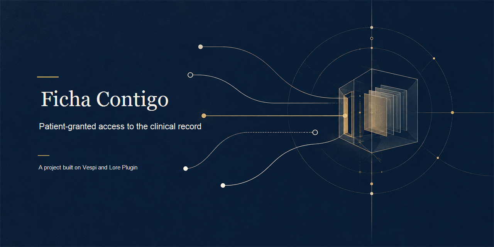

[](./assets/cover.png)

# Ficha Contigo

<p align="center">
  <a href="#english"></a>
  <a href="./LICENSE"></a>
  <a href="./docs/EVIDENCE.md"></a>
  <a href="./docs/HOW_IT_WORKS.md"></a>
  <a href="https://github.com/andresanemic/vespi"></a>
</p>

<p align="center">
  <b>Ficha Contigo puts each patient's permission at the door: a provider can use only the record part, purpose and time the patient granted.</b><br><br>
  Emergency access is granted in advance, leaves an immediate receipt and stays open for a human review.
</p>

<p align="center">
  Do you build on Stellar, or are you judging Find Your Way or Meridian? Start with the agreement, then inspect the flow and the evidence.
</p>

<p align="center">
  This repository contains the project agreement, documentation and recorded evidence, not the source code. The code will open during the judges' review period under a review-only license that permits reading and cloning for evaluation.
</p>

---

<details>
<summary><b>Read in English</b></summary>

<a id="english"></a>

**Ficha Contigo makes patient-granted access visible, scoped and reviewable.**

> **The unit is the part of the record the patient allowed, for a purpose, until a time. Emergency access is granted in advance.**

Ficha Contigo is a local prototype for a clinical record access workflow. A patient can authorize a named part of a fictional record for a stated purpose, institution, time window and number of uses. Each attempt leaves a readable record, including blocks and their reasons. An emergency mandate is granted beforehand and creates an immediate receipt plus a review that stays open until the patient or their designee closes it. All people, institutions and records are fictional. No real health or identifying data is present.

**Why.** When a person gives clinical data to an institution, it can be hard for them to see who asked for which part, for what purpose, and what was accessed. An urgent situation can also leave the patient unable to answer at the time. Ficha Contigo explores a clear boundary: a professional's reason alone does not grant access; the patient grants a specific scope, and an emergency permission must already exist and remain visible for later review.

**If you are judging Find Your Way or Meridian, start here.**

1. **Read the agreement.** [`docs/HOW_IT_WORKS.md`](./docs/HOW_IT_WORKS.md) explains the patient-granted rules in plain language.
2. **Follow one request.** The example shows the checks, the receipt, a block and the separately granted emergency path.
3. **Open the evidence.** [`docs/EVIDENCE.md`](./docs/EVIDENCE.md) lists the real test names and the result reported today: 7 of 13 pass.
4. **Read the limits.** [`docs/LEGAL_AND_LIMITS.md`](./docs/LEGAL_AND_LIMITS.md) explains the legal context cited by the agreement and the questions it leaves open.
5. **Check what is not verified.** The project was built against kernel cut `54c20c7`, while its installed kernel has since moved. Its digest-pinned suite needs an intentional re-pin and rerun; this is a working path, not a finished product or a claim of readiness for use.

## In one minute

In the fictional example, `persona-1` has a laboratory result, an imaging report and personal history. A treating professional asks to read only the laboratory result for continuity of treatment. The patient grants that professional access to that part, for that purpose, at one institution, until an expiry and within a use budget. The access leaves a receipt. A later request for the imaging report is blocked because the patient did not grant that scope. If the laboratory result changes, its old fingerprint no longer matches the permission and access is blocked. The patient can also grant an emergency mandate beforehand; when used, it leaves a receipt and an open review that the patient or a designee must later close. Every item in this example is fictional.

## Why Ficha Contigo

The clinical record stays in the institution in the intended model. This prototype uses only a local fictional data store and does not connect to an institution.

| You need | What it gives you | Where it lives |
|---|---|---|
| Permission limited to a specific part | A named scope, purpose, destination, expiry and use budget | [`docs/HOW_IT_WORKS.md`](./docs/HOW_IT_WORKS.md) |
| A changed record part to stop matching old permission | The part's fingerprint is bound to the authorization; a mismatch blocks access | [`docs/HOW_IT_WORKS.md`](./docs/HOW_IT_WORKS.md) |
| A way to withdraw future access | Patient revocation blocks later access while preserving the earlier record | [`docs/HOW_IT_WORKS.md`](./docs/HOW_IT_WORKS.md) |
| Emergency access when the patient cannot answer | An advance mandate, immediate receipt and review left open for a human to close | [`docs/HOW_IT_WORKS.md`](./docs/HOW_IT_WORKS.md) |
| A record the patient can inspect | A local JSONL record that can be read without Ficha Contigo | [`docs/EVIDENCE.md`](./docs/EVIDENCE.md) |
| Verification beyond the executor's claim | A verifier recomputes access from the record and checks receipt integrity | [`docs/EVIDENCE.md`](./docs/EVIDENCE.md) |

**What it is not.** It is not an electronic health record, a clinical system, a provider integration, a patient identity service, a medical decision-maker or a compliance claim. It does not store real clinical data or contact a health institution. It has no live emergency integration, real zero-knowledge proof, blockchain anchor or Stellar testnet transaction.

## How it works

```text
Patient grants purpose + record part + institution + expiry + uses
                              |
Professional requests access |
                              v
                   scope and fingerprint checks
                      /                 \
                 blocked              allowed
              with a reason               |
                                     access + receipt
                                          |
                                  independent verifier

Patient grants emergency mandate in advance -> receipt + open review
                                              -> patient/designee closes it
```

| Actor | Rights in the model | Limit |
|---|---|---|
| Patient | Grant and revoke ordinary access; grant an emergency mandate in advance; read the record; close its later review | Revocation does not erase access that already happened. |
| Institution | Hold the fictional record and act within what the patient authorized | The institution is fictional; no real record or provider is connected. |
| Treating or later professional | Request access for a declared purpose | A request or professional reason alone is not permission; excess scope is blocked. |
| Emergency professional | Use a mandate already granted by the patient | No advance grant means no emergency access; the professional cannot close the review. |
| Verifier | Recompute recorded access and verify receipts | It checks the record, not medical truth, identity or compliance. |

The longer walkthrough and the plain-language rules are in [`docs/HOW_IT_WORKS.md`](./docs/HOW_IT_WORKS.md).

## Evidence you can open

The current suite report is **7 passing, 6 failing, out of 13**. The test names and the meaning of each result are in [`docs/EVIDENCE.md`](./docs/EVIDENCE.md). Passing cases today cover unauthorized access, excess scope, emergency access without prior permission, the pending emergency review, edited receipt detection, the labeled simulated proof flow and a patient-readable record. Several cases that passed on the earlier pinned kernel cut fail today.

Before implementation, thirteen behavior cases were written and their red run was observed with the module skeleton in place. The later recorded green run reports 13/13 against the pinned kernel cut. The adversarial cases cover changed record fingerprints, revocation, idempotency and whether an independent verifier can reject an executor's unsupported claim. The current 7/13 is not hidden: the nine coded projects were built against the `54c20c7` kernel cut, and the project intentionally pins the kernel it consumes by digest. The installed kernel has moved to 0.1.3, so parts of the suite fail until the pin is deliberately reassessed. Re-pinning and rerunning are pending. This project shows a working path, not a finished product or readiness for use.

The recorded walkthrough used fictional data and reports the Stellar anchor as pending: nothing reached testnet. The proof of knowledge zero is simulated. No transaction hashes or testnet claims are part of this project. [`docs/EVIDENCE.md`](./docs/EVIDENCE.md) says how to rerun the suite when the code opens during the judges' review period.

## Ficha Contigo, Vespi and Lore Plugin

Ficha Contigo is one of ten functional projects built on [Vespi](https://github.com/andresanemic/vespi) with [Lore Plugin](https://github.com/andresanemic/lore-plugin). It consumes the Vespi kernel without modifying it. In the project, authority comes from the patient's grant: access is checked against purpose, scope, destination, time and use budget. Kernel receipts make recorded actions inspectable, while verification is performed separately by recomputing from the record rather than trusting the executor's summary. The record supports continuity by preserving the sequence of receipts and events. The emergency mandate and its required human review are implemented in this project's layer, not in kernel 0.1.3. The zero-knowledge proof remains simulated.

## What it does not do, and what is not verified

The prototype has no real patient or provider data, provider integration, FHIR, network activity, blockchain anchor or real zero-knowledge proof. The emergency access is a local model, not a live clinical mechanism. The cited Chilean provisions informed the design question; the project does not claim compliance with Law 21.668, Law 19.628 or any other law, and no competent legal professional has reviewed it. The regulation contemplated by article 13 was not read or verified. The suite's present 7/13 result follows a kernel change after the pinned `54c20c7` cut; the required re-pin and rerun are pending. See [`docs/LEGAL_AND_LIMITS.md`](./docs/LEGAL_AND_LIMITS.md).

## How to review this project

This repository contains documentation and evidence, not source code. The code will open during the judges' review period under the review-only [LICENSE](./LICENSE), which permits reading and cloning for evaluation. It does not grant permission to modify the code. See [`CODE_NOT_INCLUDED.md`](./CODE_NOT_INCLUDED.md) for the release note. Once open, the source's test command is `npm test`; rerun it after reviewing the pinned kernel digest and record the kernel cut used.

## Author

**Andrés Peña**, repository authority: `andresanemic`.

[](https://t.me/andresanemic) &nbsp;&nbsp; [<picture><source media="(prefers-color-scheme: dark)" srcset="./assets/icons/v2/x-dark.svg"></picture>](https://x.com/andresanemic) &nbsp;&nbsp; [](https://www.linkedin.com/in/andresanemic/)

---

[How it works](./docs/HOW_IT_WORKS.md) · [Evidence](./docs/EVIDENCE.md) · [Legal and limits](./docs/LEGAL_AND_LIMITS.md) · [Code not included](./CODE_NOT_INCLUDED.md) · [Review-only license](./LICENSE) · [Vespi](https://github.com/andresanemic/vespi) · [Lore Plugin](https://github.com/andresanemic/lore-plugin)

</details>

<details>
<summary><b>Leer en español</b></summary>

<a id="espanol"></a>

**Ficha Contigo hace visible y revisable el acceso que autoriza cada paciente.**

> **La unidad es la parte de la ficha que la paciente permitió, para un propósito y hasta una fecha. El acceso de emergencia se concede por adelantado.**

Ficha Contigo es un prototipo local de un flujo de acceso a una ficha clínica. La paciente puede autorizar una parte identificada de una ficha ficticia para un propósito, una institución, un plazo y un número de usos determinados. Cada intento deja un registro legible, incluidos los bloqueos y sus motivos. Un mandato de emergencia se concede antes de necesitarlo y deja un recibo inmediato más una revisión que permanece abierta hasta que la paciente o alguien designado la cierre. Todas las personas, instituciones y fichas son ficticias. No hay datos reales de salud ni datos personales reales.

**Por qué.** Cuando una persona entrega datos clínicos a una institución, puede ser difícil saber quién pidió qué parte, para qué y qué se consultó. En una urgencia, la persona también podría no estar en condiciones de responder en ese momento. Ficha Contigo explora un límite claro: el motivo profesional por sí solo no da acceso; la paciente concede un alcance específico, y el permiso de emergencia tiene que existir de antemano y quedar visible para su revisión posterior.

**Si estás evaluando Find Your Way o Meridian, empieza aquí.**

1. **Lee el acuerdo.** [`docs/HOW_IT_WORKS.md`](./docs/HOW_IT_WORKS.md) explica en lenguaje claro las reglas que concede la paciente.
2. **Sigue una solicitud.** El ejemplo muestra las comprobaciones, el recibo, un bloqueo y la ruta de emergencia concedida por separado.
3. **Abre la evidencia.** [`docs/EVIDENCE.md`](./docs/EVIDENCE.md) enumera los nombres reales de las pruebas y el resultado informado hoy: pasan 7 de 13.
4. **Lee los límites.** [`docs/LEGAL_AND_LIMITS.md`](./docs/LEGAL_AND_LIMITS.md) explica el contexto legal citado por el acuerdo y las preguntas abiertas.
5. **Comprueba qué no está verificado.** El proyecto se construyó sobre el corte `54c20c7` del kernel, que desde entonces cambió en la instalación. La suite fija sus digest y necesita una revisión deliberada de esa fijación y una nueva corrida; muestra un camino que funciona, no un producto terminado ni una afirmación de estar listo para uso.

## En un minuto

En el ejemplo ficticio, `persona-1` tiene un resultado de laboratorio, un informe de imagenología y antecedentes personales. Un profesional tratante solicita leer solo el resultado de laboratorio para dar continuidad al tratamiento. La paciente le concede acceso a esa parte, para ese propósito, en una institución, hasta un vencimiento y dentro de un presupuesto de usos. El acceso deja un recibo. Una solicitud posterior del informe de imagenología se bloquea porque la paciente no concedió ese alcance. Si cambia el resultado de laboratorio, su huella anterior ya no coincide con el permiso y el acceso se bloquea. La paciente también puede conceder un mandato de emergencia por adelantado; cuando se usa, deja un recibo y una revisión abierta que luego debe cerrar la paciente o alguien designado. Todos los elementos de este ejemplo son ficticios.

## Por qué Ficha Contigo

En el modelo previsto, la ficha clínica permanece en la institución. Este prototipo solo usa un almacén local de datos ficticios y no se conecta con una institución.

| Necesitas | Qué te da | Dónde vive |
|---|---|---|
| Permiso limitado a una parte específica | Un alcance, propósito, destino, vencimiento y presupuesto de usos identificados | [`docs/HOW_IT_WORKS.md`](./docs/HOW_IT_WORKS.md) |
| Que un cambio en la ficha deje de coincidir con el permiso anterior | La huella de la parte queda ligada a la autorización; una diferencia bloquea el acceso | [`docs/HOW_IT_WORKS.md`](./docs/HOW_IT_WORKS.md) |
| Retirar futuros accesos | La revocación de la paciente bloquea accesos posteriores y conserva el registro anterior | [`docs/HOW_IT_WORKS.md`](./docs/HOW_IT_WORKS.md) |
| Acceso de emergencia si la paciente no puede responder | Un mandato previo, un recibo inmediato y una revisión abierta para que una persona la cierre | [`docs/HOW_IT_WORKS.md`](./docs/HOW_IT_WORKS.md) |
| Un registro que la paciente pueda inspeccionar | Un registro JSONL local que puede leerse sin Ficha Contigo | [`docs/EVIDENCE.md`](./docs/EVIDENCE.md) |
| Verificación más allá de lo que afirma el ejecutor | Un verificador recalcula los accesos desde el registro y comprueba la integridad de los recibos | [`docs/EVIDENCE.md`](./docs/EVIDENCE.md) |

**Lo que no es.** No es una ficha electrónica, un sistema clínico, una integración con prestadores, un servicio de identidad de pacientes, un sistema de decisión médica ni una afirmación de cumplimiento. No guarda datos clínicos reales ni contacta a una institución de salud. No tiene una integración de emergencia activa, una prueba real de conocimiento cero, un anclaje en blockchain ni transacciones en Stellar testnet.

## Cómo funciona

```text
La paciente concede propósito + parte + institución + plazo + usos
                              |
El profesional solicita acceso |
                              v
                    comprobación de alcance y huella
                       /                  \
                 bloqueado             permitido
                  con razón                 |
                                  acceso + recibo
                                          |
                                 verificador independiente

Mandato de emergencia previo -> recibo + revisión abierta
                              -> la paciente/designada la cierra
```

| Actor | Derechos en el modelo | Límite |
|---|---|---|
| Paciente | Conceder y revocar acceso ordinario; conceder un mandato de emergencia por adelantado; leer el registro; cerrar su revisión posterior | La revocación no borra un acceso que ya ocurrió. |
| Institución | Custodiar la ficha ficticia y actuar dentro de lo que autorizó la paciente | La institución es ficticia; no hay una ficha ni un prestador reales conectados. |
| Profesional tratante o posterior | Solicitar acceso para un propósito declarado | La solicitud o el motivo profesional no son permiso; el exceso de alcance se bloquea. |
| Profesional de emergencia | Usar un mandato que la paciente ya concedió | Sin permiso previo no hay acceso de emergencia; el profesional no puede cerrar la revisión. |
| Verificador | Recalcular los accesos registrados y verificar los recibos | Comprueba el registro, no la verdad médica, la identidad ni el cumplimiento legal. |

El recorrido detallado y las reglas en lenguaje claro están en [`docs/HOW_IT_WORKS.md`](./docs/HOW_IT_WORKS.md).

## Evidencia que puedes abrir

El informe actual de la suite es **7 pruebas pasan, 6 fallan, de un total de 13**. Los nombres de las pruebas y el significado de cada resultado están en [`docs/EVIDENCE.md`](./docs/EVIDENCE.md). Hoy pasan los casos de acceso sin autorización, exceso de alcance, emergencia sin permiso previo, revisión de emergencia pendiente, detección de recibos editados, flujo etiquetado como prueba simulada y registro legible por la paciente. Varios casos que pasaron con el corte anterior del kernel fallan hoy.

Antes de la implementación se escribieron trece casos de comportamiento y se observó su corrida roja con el esqueleto del módulo presente. La corrida verde registrada después informa 13/13 contra el corte fijado del kernel. Los casos adversariales cubren huellas alteradas, revocación, idempotencia y si un verificador independiente puede rechazar una afirmación del ejecutor que el registro no respalda. No escondemos el 7/13 actual: los nueve proyectos con código se construyeron contra el corte `54c20c7` del kernel y cada proyecto fija por digest el kernel que consume. El kernel instalado cambió a 0.1.3, así que parte de la suite falla hasta que se reevalúe esa fijación de manera deliberada. La nueva fijación y la nueva corrida están pendientes. Este proyecto muestra un camino que funciona, no un producto terminado ni algo listo para uso.

El recorrido registrado usó datos ficticios y deja el anclaje de Stellar como pendiente: nada llegó a testnet. La prueba de conocimiento cero está simulada. Este proyecto no tiene hashes de transacciones ni afirmaciones de actividad en testnet. [`docs/EVIDENCE.md`](./docs/EVIDENCE.md) explica cómo volver a correr la suite cuando el código se abra durante el periodo de los jueces.

## Ficha Contigo, Vespi y Lore Plugin

Ficha Contigo es uno de los diez proyectos funcionales construidos sobre [Vespi](https://github.com/andresanemic/vespi) con [Lore Plugin](https://github.com/andresanemic/lore-plugin). Consume el kernel de Vespi sin modificarlo. En el proyecto, la autoridad nace del permiso de la paciente: el acceso se comprueba contra propósito, alcance, destino, plazo y presupuesto de usos. Los recibos del kernel hacen inspeccionables las acciones registradas, mientras que la verificación se realiza por separado, recalculando desde el registro en lugar de confiar en el resumen del ejecutor. El registro permite continuidad al conservar la secuencia de recibos y eventos. El mandato de emergencia y su revisión humana obligatoria viven en la capa de este proyecto, no en el kernel 0.1.3. La prueba de conocimiento cero sigue simulada.

## Lo que no hace y lo que no está verificado

El prototipo no tiene datos reales de pacientes ni prestadores, integración institucional, FHIR, actividad de red, anclaje en blockchain ni prueba real de conocimiento cero. El acceso de emergencia es un modelo local, no un mecanismo clínico activo. Las normas chilenas citadas orientaron la pregunta de diseño; el proyecto no afirma cumplir la Ley 21.668, la Ley 19.628 ni ninguna otra norma, y ninguna persona competente en derecho lo ha revisado. El reglamento que contempla el artículo 13 no se leyó ni se verificó. El resultado actual de 7/13 sigue al cambio del kernel desde el corte fijado `54c20c7`; la nueva fijación y la nueva corrida están pendientes. Consulta [`docs/LEGAL_AND_LIMITS.md`](./docs/LEGAL_AND_LIMITS.md).

## Cómo revisar este proyecto

Este repositorio contiene documentación y evidencia, no código fuente. El código se abrirá durante el periodo de los jueces bajo la [LICENSE](./LICENSE) de solo revisión, que permite leer y clonar para evaluar. No concede permiso para modificar el código. Consulta [`CODE_NOT_INCLUDED.md`](./CODE_NOT_INCLUDED.md). Cuando esté abierto, el comando de pruebas del paquete fuente es `npm test`; vuelve a correrlo después de revisar el digest fijado del kernel y registra qué corte se usó.

## Autor

**Andrés Peña**, autoridad del repositorio: `andresanemic`.

[](https://t.me/andresanemic) &nbsp;&nbsp; [<picture><source media="(prefers-color-scheme: dark)" srcset="./assets/icons/v2/x-dark.svg"></picture>](https://x.com/andresanemic) &nbsp;&nbsp; [](https://www.linkedin.com/in/andresanemic/)

---

[Cómo funciona](./docs/HOW_IT_WORKS.md) · [Evidencia](./docs/EVIDENCE.md) · [Marco legal y límites](./docs/LEGAL_AND_LIMITS.md) · [Código no incluido](./CODE_NOT_INCLUDED.md) · [Licencia de solo revisión](./LICENSE) · [Vespi](https://github.com/andresanemic/vespi) · [Lore Plugin](https://github.com/andresanemic/lore-plugin)

</details>
